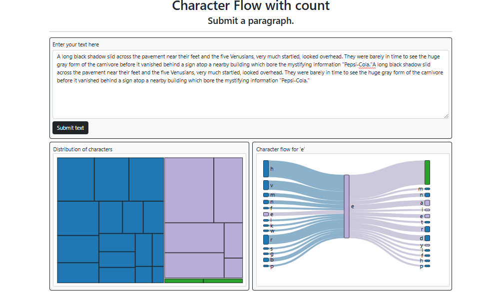
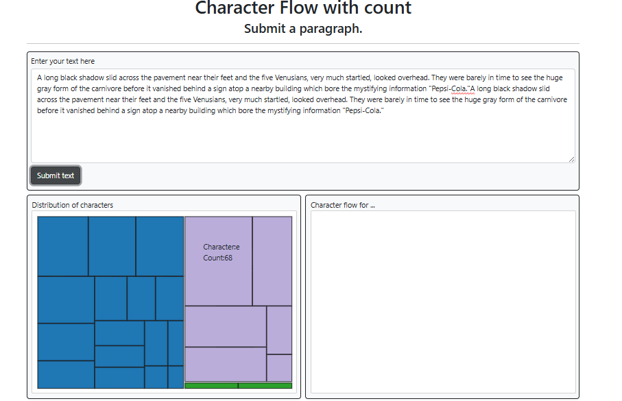

# Character Frequency Analysis using Treemap and Sankey Diagrams

This project visualizes the frequency of characters in a given text using two interactive visualizations: **Treemap** and **Sankey** diagrams. The **Treemap** represents the count of each character, while the **Sankey** shows the relationships between a selected character and its immediate predecessor and successor characters based on their count.

## Features

1. **Treemap Visualization**:
    - Each rectangle represents a unique character in the text, with the area proportional to the character's frequency.
    - Hover over a rectangle to see the character and its count.
    - Click on a rectangle to explore that character's relationships in the Sankey diagram.

2. **Sankey Diagram**:
    - Displays the flow of the selected character's frequency in relation to its predecessor and successor characters in the text.
    - Clicking on any character in the Treemap dynamically generates a Sankey diagram, showing the character's immediate context in the text.
    -  Hover over a rectangle to see the character and its count.

## How to Use

1. **Treemap**:
    - Each rectangle represents a character in the Text.
    - Hover over any rectangle to view the character and its frequency in the dataset.
    - Click on any rectangle to generate a corresponding Sankey diagram.

2. **Sankey**:
    - Once a character is selected in the Treemap, the Sankey diagram shows the flow from the predecessor characters to the selected character, and from the selected character to its successor characters.

## Screenshots

1. **Example**  
   

2. **Example**  
   

3. **Hover**  
   

## Setup

1. Clone the repository:
   ```bash
   git clone https://github.com/sanjaybhattoo/CharacterCountD3.git
